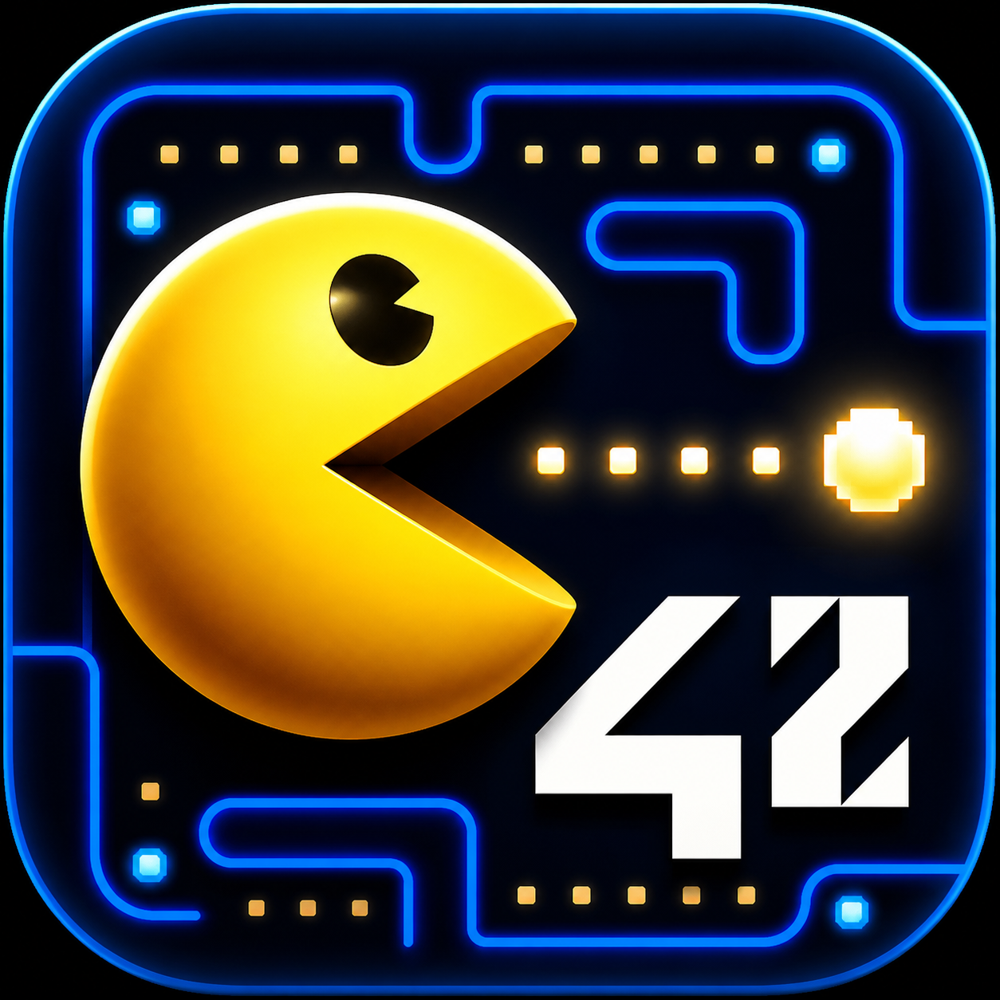
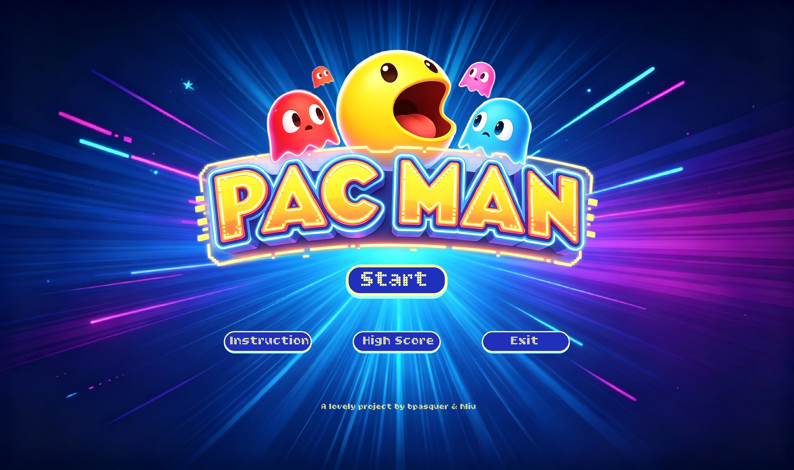
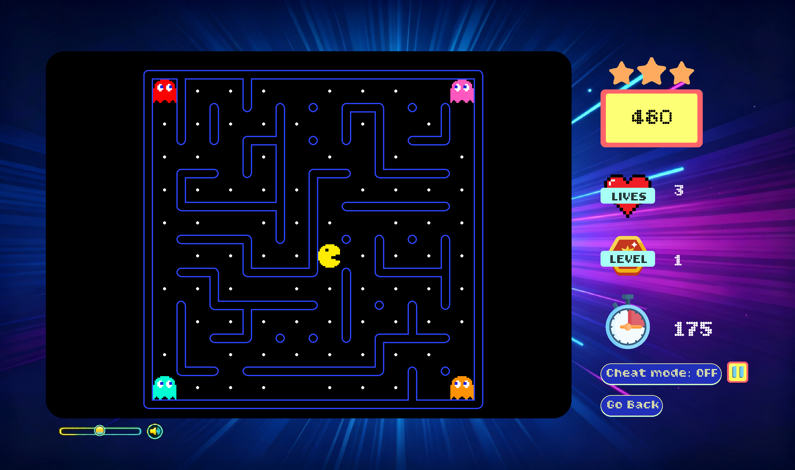
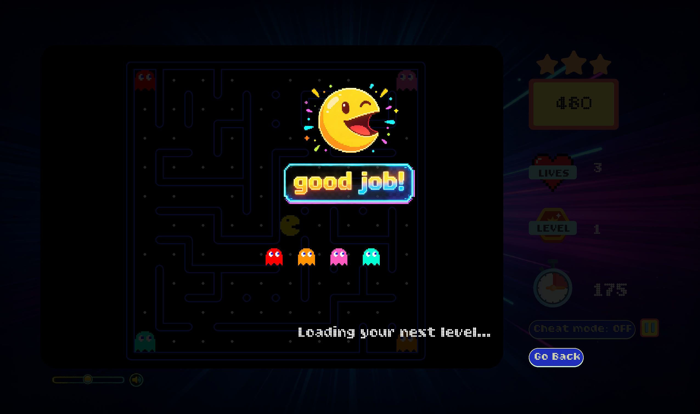
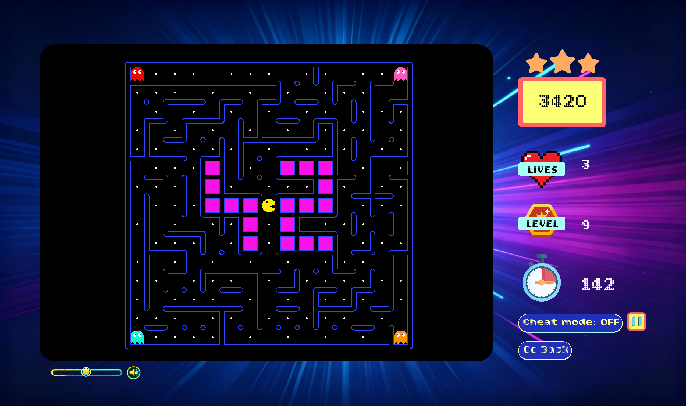
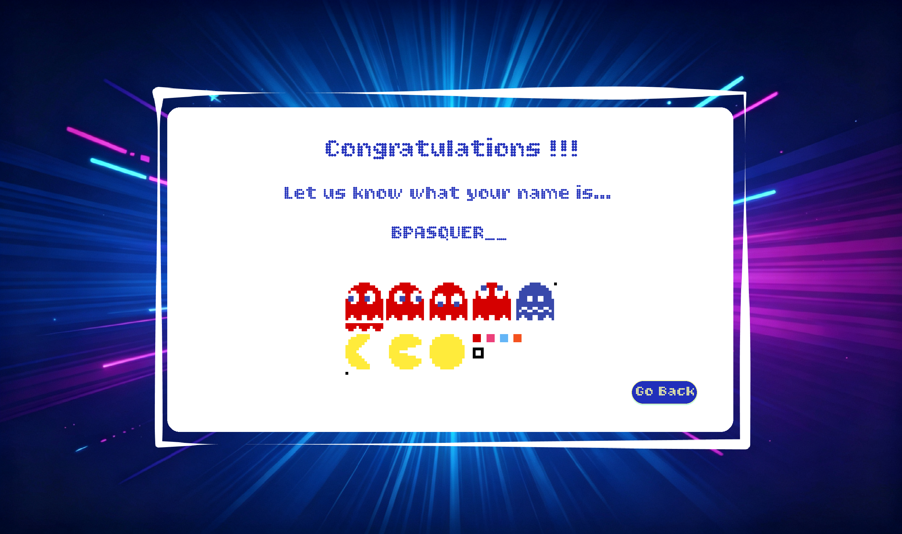
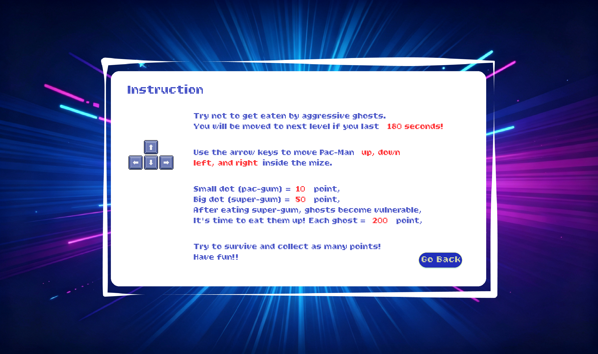

<p align="center">
  
</p>

<h1 align="center">Pac-Man</h1>

<p align="center">
  <strong>Arcade Pac-Man recreation in Python with Pygame-CE, procedural maze generation, and BFS ghost AI.</strong><br>
  <em>Created as part of the 42 curriculum by bpasquer and hliu.</em>
</p>

<p align="center">
  <a href="#overview">Overview</a> •
  <a href="#installation">Installation</a> •
  <a href="#controls">Controls</a> •
  <a href="#configuration">Configuration</a> •
  <a href="#gameplay-summary">Gameplay</a> •
  <a href="#software-architecture">Architecture</a> •
  <a href="#license">License</a>
</p>

<p align="center">
  
  
  
  
  
  
  
</p>

<p align="center">
  
</p>

<p align="center">
  
</p>

<p align="center">
  
</p>

<p align="center">
  
</p>

<p align="center">
  
</p>

---

## Overview

Pac-Man is a Python recreation of the classic arcade game. The goal is to
navigate generated mazes, eat pacgums, use super-pacgums to make ghosts edible,
survive the four ghosts, and complete all configured levels with the highest
possible score.

The project was built with object-oriented Python, `pygame-ce` for the graphical
interface, a configuration-driven game setup, an external A-Maze-ing maze
generator package, persistent highscores, a main menu, an in-game HUD, pause and
game-over handling, and cheat-mode helpers for peer evaluation.

## Installation

### Requirements

- Python 3.10 or later
- `uv` for dependency installation and command execution
- A terminal capable of running `make`

Project dependencies are declared in `pyproject.toml`:

- `pygame-ce`
- `pydantic`
- `numpy`
- `mypy`
- `flake8`
- `black`

### Run from Source

Install dependencies and unpack the assigned maze generator wheel:

```bash
make install
```

*(Equivalent dependency installation: `uv sync`)*

Launch the game with a configuration file:

```bash
make run
```

`make run` installs dependencies if needed, then executes:

```bash
uv run python3 pac-man.py config.json
```

Or run directly with Python:

```bash
python3 pac-man.py config.json
```

### Standalone macOS Application & itch.io

A restricted itch.io build is available here:

https://bpasquer.itch.io/pacman-42

The public-platform build currently targets macOS. It is distributed as a downloadable package containing the bundled runtime, assets, sounds, fonts, `config.json`, and the writable highscore location used by the packaged app.

#### macOS Security Note (Gatekeeper)

If you downloaded the pre-compiled **`PacMan.app`** bundle on macOS, Apple Gatekeeper may block it on first launch with a warning dialog because it is not signed with a paid Apple Developer certificate.

To open the application:
1. Open **System Settings** > **Privacy & Security**.
2. Scroll down to the **Security** section.
3. Next to *"PacMan was blocked to protect your Mac"*, click **Open Anyway**.

*(Alternatively, run `xattr -d com.apple.quarantine PacMan.app` in Terminal to clear the quarantine flag).*

### Packaging & Standalone Build

To bundle the standalone application for macOS with PyInstaller, refer to the full step-by-step guide in [PACKAGING.md](PACKAGING.md).

If a packaged build is regenerated, it must be rebuilt on the target operating system with PyInstaller before being uploaded again to itch.io.

### Developer Commands

#### Debug

```bash
make debug
```

#### Lint

Run the required flake8 and mypy checks:

```bash
make lint
```

Optional strict mypy mode:

```bash
make lint-strict
```

#### Clean

Remove Python caches, virtual environments, generated maze package files, and runtime score output:

```bash
make clean
```

## Controls

- Arrow keys: choose Pac-Man's direction.
- Space: pause or resume the current game.
- `C`: toggle cheat mode.
- Mouse: interact with menu buttons, pause/resume button, return-to-menu button,
  cheat controls, level-skip button, and the volume slider.

Pac-Man starts each level paused and begins moving only after a direction key is
pressed.

<p align="center">
  
</p>

## Configuration

The game reads a JSON configuration file passed on the command line. The parser
also accepts comment lines starting with `#` or `//`; those lines are ignored
before JSON parsing.

Example:

```json
{
  "highscore_filename": "scores.json",
  "levels": [
    { "width": 10, "height": 10, "seed": 42 },
    { "width": 13, "height": 13, "seed": 45653 }
  ],
  "lives": 3,
  "pacgum": 42,
  "points_per_pacgum": 10,
  "points_per_super_pacgum": 50,
  "points_per_ghost": 200,
  "level_max_time": 180
}
```

### Supported Keys

| Key | Type | Fallback default | Description |
| --- | --- | --- | --- |
| `highscore_filename` | string | `scores.json` | File used to load and save highscores. |
| `levels` | array | one `13x13` level | List of level definitions. |
| `levels[].width` | integer | `13` | Maze width in cells. |
| `levels[].height` | integer | `13` | Maze height in cells. |
| `levels[].seed` | integer | `42` | Seed value documented for level reproducibility. |
| `lives` | integer | `3` | Number of lives at game start. |
| `pacgum` | integer | `42` | Pacgum-related configuration value from the subject. |
| `points_per_pacgum` | integer | `10` | Score gained when eating a regular pacgum. |
| `points_per_super_pacgum` | integer | `50` | Score gained when eating a super-pacgum. |
| `points_per_ghost` | integer | `200` | Score gained when eating a vulnerable ghost. |
| `level_max_time` | integer | `90` | Time limit for each level, in seconds. |

Unknown keys are ignored. Missing or invalid known values are replaced with safe
defaults when possible, and clear error messages are printed for invalid files or
invalid command-line usage instead of exposing a Python traceback to the player.

The provided `config.json` contains 10 levels and uses `180` seconds as the
level time limit.

## Highscore System

Highscores are stored in a JSON file, by default `scores.json`. The file contains
a list of objects with a player name and a non-negative score:

```json
[
  { "name": "PLAYER", "score": 1200 }
]
```

The game loads highscores from disk, tolerates a missing or malformed score file
by falling back to an empty list, and saves only the top 10 scores sorted from
highest to lowest. This JSON-based approach was chosen because it is simple,
human-readable, easy to reset during peer review, and sufficient for a local
arcade-style game.

The main menu includes a highscore page. When the game ends, the intended flow is
to display the final score, let the player enter a name, save the score if it
belongs in the top 10, then return to the main menu.

## Maze Generation

Mazes are generated with the assigned external A-Maze-ing package, not with a
custom generator. The repository includes the assigned wheel
`mazegenerator-00001-py3-none-any.whl`; `make install` unpacks it when the local
`mazegenerator` package directory is missing.

The integration is isolated in `pacman/core/level.py`. Each `Level` creates a
`MazeGenerator` instance with:

```python
MazeGenerator(size=(width, height))
```

The rest of the game consumes the generated maze grid through the `Level` and
`GameState` objects. Wall collisions, pacgum placement, ghost paths, and drawing
all use that generated grid. This keeps the project adapted to the assigned
package while avoiding modifications to the package itself.

## Gameplay Summary

- The game contains at least 10 configured levels.
- Pac-Man starts near the center of the maze.
- Four ghosts start in the four maze corners.
- Regular pacgums are placed in available corridors.
- Super-pacgums are placed in the four corners.
- Eating all pacgums and super-pacgums completes the level.
- Completing the last configured level wins the game.
- Touching a normal ghost removes one life unless cheat mode is enabled.
- After losing a life, Pac-Man respawns in the center and ghosts respawn in their
  corners.
- Eating a super-pacgum makes ghosts vulnerable for a limited time.
- Eating a vulnerable ghost grants points and makes that ghost respawn later.
- If the timer reaches zero, the player loses a life and the level is reset if
  lives remain.

### Scoring

- Regular pacgum: `points_per_pacgum`
- Super-pacgum: `points_per_super_pacgum`
- Vulnerable ghost: `points_per_ghost`

The score never decreases.

### Ghost Behavior

- Blinky directly targets Pac-Man.
- Pinky targets cells ahead of Pac-Man's current direction.
- Inky targets a position mirrored from Blinky through a point ahead of Pac-Man.
- Clyde alternates between chasing Pac-Man and returning to its corner.
- Vulnerable ghosts head back toward their starting corners.

### Cheat Mode

Cheat mode is designed to help peer reviewers test the game quickly:

- Press `C` or use the cheat button to toggle it.
- Cheat mode gives very high lives and time.
- The level-skip button can advance through levels and instantly add to your score the total number of points of all pacgums and superpacgums of the level you skipped
- On the final level, level skip can trigger the game-won flow.
- Normal ghosts cannot remove lives while cheat mode is active.

## Implementation

The game loop is managed by `GameEngine`. It handles Pygame events, updates the
state, moves Pac-Man and ghosts using delta time, checks collisions, updates the
timer, and asks the visual layer to draw each frame.

Movement is frame-rate independent. Speeds are expressed in cells per second, and
the engine converts them to pixels per frame with the current cell size and the
elapsed time returned by `clock.tick(60)`.

Pacgums are eaten when Pac-Man's visible body overlaps their center, not only
when Pac-Man reaches the next grid cell. This makes the gameplay feel closer to
the original arcade behavior.

The UI is rendered with Pygame surfaces and sprite assets. It includes:

- main menu
- instructions page
- highscore page
- game HUD
- volume control
- pause/resume controls
- game-over and level-completion screens

## General Software Architecture

```text
pac-man.py
  -> pacman.config.Parser
  -> pacman.engine.GameEngine
       -> pacman.core.GameState
            -> Statistics
            -> PacmanStateMixin
            -> GhostStateMixin
            -> Level
                 -> A-Maze-ing MazeGenerator
       -> pacman.engine.EngineUtils
       -> pacman.visual.GameVisual
            -> MenuVisualMixin
            -> PlayVisualMixin
            -> MazeVisualMixin
            -> VisualBase
```

### Main Modules

- `pac-man.py`: program entry point; parses the config and starts the engine.
- `pacman/config/`: command-line and JSON-with-comments parsing.
- `pacman/core/`: game state, statistics, level data, Pac-Man state, ghost state,
  and shortest-path logic.
- `pacman/engine/`: event handling, update loop, movement, scoring, collisions,
  timers, and game progression.
- `pacman/visual/`: Pygame drawing code for menus, HUD, maze, entities, and
  overlays.
- `pacman/ui/`: reusable UI primitives such as buttons and colors.
- `img/`, `assets/`, `sounds/`, `fonts/`: graphical, audio, and font assets.
- `project_management/`: project management evidence required by the subject.

The architecture separates state, game rules, and rendering. `GameState` owns the
data, `EngineUtils` and `GameEngine` update that data, and `GameVisual` displays
it.

## Project Management

Project management artifacts are stored in the
[`project_management`](project_management) directory. This directory contains the
team report and planning evidence, including a Gantt chart. It documents the
development process, collaboration, choices, risks, implementation progress, and
testing/bug-tracking approach.

The project was developed by two students, with work split across gameplay,
configuration parsing, UI, graphics, maze integration, ghost behavior, scoring,
highscores, testing, and documentation.

## Resources and AI Usage

### Resources

- [Pygame Tutorial](https://www.geeksforgeeks.org/python/pygame-tutorial/)
- [Starts with pygame](https://www.youtube.com/watch?v=blLLtdv4tvo)
- [Python dataclasses documentation](https://docs.python.org/3/library/dataclasses.html)
- [Python pathlib](https://docs.python.org/3/library/pathlib.html)
- [Pac-Man ghost behavior reference](https://pacman.fandom.com/wiki/Maze_Ghost_AI_Behaviors)

### AI Usage

AI assistance was used as a development support tool, not as a replacement for
understanding or peer review. It helped with:

- explaining Python and Pygame concepts during implementation;
- debugging specific runtime errors and state-management issues;
- comparing design options for game state, ghost state, movement, and timing;
- generating or adjusting small visual assets;
- improving documentation wording and structure;
- identifying edge cases to test during gameplay.

All generated suggestions were reviewed, adapted, and tested in the project
context by the team before being kept.

---

## License

This project is licensed under the [MIT License](LICENSE). Non-commercial educational fan recreation created as part of the 42 curriculum.
