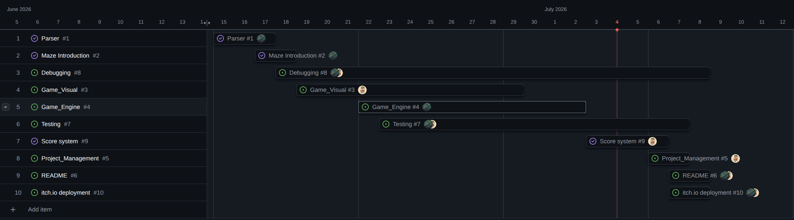

# Project Management Report

## Project Overview

This project was developed using Git and GitHub following a collaborative development workflow. Team members worked on separate branches, regularly merged their work, resolved conflicts, and continuously integrated new features. The commit history demonstrates an iterative development process involving feature implementation, bug fixing, code refactoring, documentation updates, and project management activities.

---

# 1. Development Timeline

### Phase 1 – Project Setup and Foundation

The project began with repository organization and environment configuration.

**Key activities**

* Reorganized project structure.
* Added `.gitignore`.
* Adapted screen resolution.
* Combined visual components with maze logic.
* Introduced testing and debugging files.
* Implemented fullscreen support.
* Added initial project documentation.

**Representative commits**

* Repository reorganization
* Screen size adaptation
* Git configuration
* Fullscreen implementation

---

### Phase 2 – Core Gameplay Development

The team focused on implementing the main game mechanics.

**Completed tasks**

* Pac-Man movement improvements.
* Ghost movement implementation.
* Vulnerable ghost mode.
* Super Pac-Gums.
* Collision detection.
* Respawn mechanism.
* Wall rendering.
* Maze refinement.
* Pac-Gum collection logic.

This phase represents the majority of the functional game development.

---

### Phase 3 – User Interface and Experience

Attention shifted toward improving usability and visual quality.

**Completed tasks**

* Loading page and loading animation.
* Responsive UI layout.
* Volume control bar.
* Game Over screen.
* Good Job screen.
* Instruction page improvements.
* Responsive positioning of UI elements.
* Removal of unnecessary navigation buttons.

Several commits specifically mention improving responsiveness and polishing interface details.

---

### Phase 4 – Audio and Game Polish

The team enhanced the overall game experience by integrating multimedia features.

**Completed tasks**

* Background music.
* Sound effects.
* Ghost sound effects.
* Game Over audio.
* Level completion audio.
* JSON-based score loading.
* JSON save/load support.

---

### Phase 5 – Final Integration and Project Completion

The final stage focused on project stabilization.

Activities included:

* Merge conflict resolution.
* Makefile improvements.
* Documentation updates.
* Code cleanup.
* Final notes.
* Project management documentation.
* Final testing.

The final commits indicate the project was nearing completion, with only minor issues and optional features remaining.

---

# 2. Features Completed

The commit history indicates the successful implementation of the following major features.

## Gameplay

* Ghost AI movement
* Vulnerable ghost mode
* Super Pac-Gums
* Pac-Gum collection
* Player respawn
* Speed adjustment
* Improved wall rendering
* Responsive gameplay rendering

## User Interface

* Loading screen
* Loading animation
* Responsive interface
* Volume control
* Game Over page
* Good Job page
* Instruction page
* Automatic navigation after Game Over

## Audio

* Background music
* Sound effects
* Game Over sound
* Ghost sounds
* Level completion sound

## System Features

* Fullscreen support (partial)
* JSON score management
* Improved Makefile
* Cleaner build process
* Parser improvements
* Code refactoring

---

# 3. Bug Fixes

The project followed continuous debugging throughout development rather than postponing fixes until the end.

Notable fixes include:

* Fixed quit error using `sys.exit(0)`.
* Corrected loading performance issues.
* Fixed merge conflicts.
* Improved Pac-Gum collision accuracy.
* Fixed responsive rendering positions.
* Improved loading animation.
* Addressed multiple rendering issues.
* Identified remaining known bugs for future work.

Frequent bug-fix commits demonstrate an iterative testing and quality assurance process.

---

# 4. Team Contributions

The Git history reflects collaborative development using feature branches and frequent merges.

### Collaborative Practices

* Individual feature branches
* Regular merges into the main branch
* Conflict resolution
* Continuous integration
* Shared ownership of features

### Major Contributions Observed

**Gameplay**

* Ghost behaviour
* Pac-Man mechanics
* Collision system
* Level progression

**User Interface**

* Loading animation
* Responsive interface
* Volume controls
* Menu improvements

**Audio**

* Background music
* Sound effects
* Audio integration

**Project Maintenance**

* Documentation updates
* Notes
* README improvements
* Makefile enhancements
* Code cleanup

Several commits also demonstrate active communication within the repository, including notes about unfinished work, requests for collaboration, and task planning. These messages illustrate effective teamwork and coordination throughout the project.

---

# 5. Overall Project Progress

Based on the commit history, the project followed a typical Agile and incremental development process.

The detailed track file of tests and debugs can be found in the [.txt file](./tests_and_bugs.txt)

### Progress Summary

The following components were developed collaboratively by both team members: 

- Program testings and debugging
- Reponsive design
- Project polishing
- deployment (itch.io)
- README

A more detailed breakdown of individual responsibilities is provided below.

| bpasquer               | hliu             |
| ---------------------- | ---------------- |
| Parser                 | UI/UX design     |
| Maze extraction        | Audio integration|
| Maze integration in "play mode" | Pygame rendering |
| Core Game logic        | Score system     |
| Code restructure       | Documentation    |
| Cheat Mode             |     |

The later commits mainly focus on refinement, optimization, documentation, and minor fixes.

The following Gantt chart illustrates the overall project timeline and development progress.

---

# 6. Conclusion

The Git commit history demonstrates a well-managed collaborative software development process. The project evolved through multiple incremental stages, beginning with repository setup and core gameplay implementation, followed by interface development, multimedia integration, testing, and final refinement.

Regular commits, frequent merges, continuous bug fixing, and documentation updates indicate consistent project progress and effective version control practices. The team successfully applied GitHub as a collaborative development platform, enabling parallel development, integration of new features, and systematic project management.

Overall, the commit history provides strong evidence of an organized development workflow and successful completion of the project's primary objectives.
